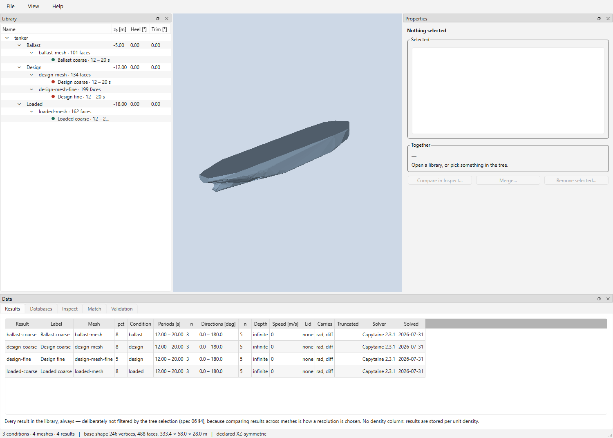

# Pylot

Pylot is a helper application for Capytaine and, in the future, other BEM solvers.

It helps to develop and maintain a library of hydrodynamic data for a single vessel spanning multiple drafts, grids, heel and trim.


The whole idea is a follows:

1. define a base-shape for a vessel.
2. create calculation meshes for different "floating conditions" by cutting the base-shape at the water-surface and meshing (automatic)
3. run capytaine to obtain hydrodynamic data
4. store in a sqlite database

then, on the consumer side:

1. load the database
2. get the best matching floating condition (using surface probes)
3. convert into a mafredo hyddb1 for further use

to limit the python environment for the consumer side, the pylot package is split into pylot-db and pylot-bem.

## run

`uvx pylot-bem`

# pylot-bem

Write side of the hydrodynamic database: meshing, in-process Capytaine solving,
assembly, a command line and a standalone application.

`Pylot` **is a** `pylot_db.Library` — it adds meshing and solving to the same
object, so a file written here opens as a plain `Library` on a machine with no
BEM solver installed. That split is the point, and a test enforces it.

## Build a library

```python
import numpy as np
from pylot_bem import Pylot, SolveSettings

d = Pylot.create_new("tanker.pylot", "tanker.stl", "stern, centerline, keel",
                     is_xz_symmetric=True)

condition = d.create_condition(z_origin=-12.0, condition_id="design")
mesh      = d.create_mesh(condition, pct=2.0)
result    = d.run_solve(mesh, SolveSettings(
    omegas=[2 * np.pi / T for T in (12.0, 16.0, 20.0)],
    wave_directions=[0.0, 45.0, 90.0, 135.0, 180.0],
))

print(d.validate() or "clean")
d.close()
```

Reading one back is [`pylot-db`](https://github.com/dave-open/pylot-db), which
this package depends on and which needs no solver.

## The application

```bash
uv run pylot-bem
```



A window for building and inspecting libraries: the tree, a 3D view in
diffraction space, property panes, and tabs for Results, Databases, Inspect,
Match and Validation. [`docs/manual.md`](docs/manual.md) walks through it screen
by screen and assumes you already know Capytaine.

### Filling a library overnight

Right-click the library → `Batch…`. A grid of drafts, heels and trims, and one
line per mesh saying which periods it carries:

```
z_origin  -4.7 to -0.1 step 0.1     heel  -1, 0, 1     trim  -2, -1, 0, 1, 2

1 -> 1, 2, 3, 4
2 -> 5, 6, 7, 8, 9, 10, 12
```

705 conditions, 1410 meshes, 1410 solves — counted on screen before Start. A step
that fails is logged and the run carries on, and starting the same job again
resumes rather than duplicates, so a night that ended early needs no arithmetic
to continue.

`Save job…` keeps the whole thing as a 29-line text file beside the library, so
it can be edited, kept and run again. `pylot_bem.batch` is the same feature
without a window.

### Standalone executable

```bash
uv sync --group build
uv run pyinstaller packaging/pylot-bem.spec --noconfirm
```

Produces `dist/pylot/pylot.exe` — no Python install required on the target
machine. Zip the `dist/pylot/` folder to distribute it.

## What is where

| | |
|---|---|
| [`docs/manual.md`](docs/manual.md) | The application, screen by screen |
| [`docs/api.md`](docs/api.md) | The reference: every public name, with its units |
| [`examples/`](examples/) | Six runnable scripts, smallest first |
| [`docs/README.md`](docs/README.md) | Where the specification lives and why it is not here |

## Licence

MIT. Copyright 2026 Ruben de Bruin / DAVE Lab.
