# The pylot application — user manual

For someone who already knows Capytaine. This does not explain boundary element
methods, panel meshes or radiation-diffraction theory; it explains what `pylot`
puts *around* them and where it will surprise you.

- [What this is](#what-this-is)
- [Starting it](#starting-it)
- [The window](#the-window)
- [1. Create a library](#1-create-a-library)
- [2. Add a floating condition](#2-add-a-floating-condition)
- [3. Build a calculation mesh](#3-build-a-calculation-mesh)
- [4. Solve](#4-solve)
- [4a. Batch — a night of it](#4a-batch--a-night-of-it)
- [5. Look at what came back](#5-look-at-what-came-back)
- [6. Resolve a conflict](#6-resolve-a-conflict)
- [7. Get the data out](#7-get-the-data-out)
- [Conventions](#conventions-the-short-list)
- [Regenerating these pictures](#regenerating-these-pictures)

---

## What this is

A **library** is one file — SQLite, extension `.pylot` — holding one hull and
every solve you have run against it. Its structure is four levels deep:

```
library          one base shape, in vessel-local coordinates
└─ condition     how the vessel floats: a 4x4 transform
   └─ mesh       the hull cut at that waterline, in diffraction space
      └─ result  one Capytaine run over a frequency and direction grid
```

Two things about this differ sharply from driving Capytaine yourself.

**A result is not a database.** A database is *assembled* from every result on a
condition, frequency by frequency. Two results that cover different frequencies
combine; two that both claim the same frequency are a **conflict**, and a
condition in conflict produces no database at all until you resolve it. Nothing
picks a winner for you, anywhere in this application. That is the central design
decision, and section 6 is about living with it.

**There is no water density.** Every solve runs at 1 t/m³ and the density is
applied when a database is delivered. Added mass, damping and excitation are all
exactly linear in ρ, so storing it would only create something that could later
be wrong. One library serves salt water, fresh water and anything else.

---

## Starting it

```bash
uv run pylot-app
```

Equivalently `uv run python -m pylot_bem.app`, and either form takes one
optional argument — a library to open:

```bash
uv run pylot-app tanker.pylot
```

There are no other options. The application is not a command-line tool; the
command line that *is* one is `pylot` (see `10_cli.md` in the specification).

---

## The window


Four regions, and each answers a different question.

| | |
|---|---|
| **Library** (left) | *What is in here.* The tree, with z₀, heel and trim as columns so drafts can be compared at a glance. A coloured dot on a result is its database's state: green clean, amber incomplete, red in conflict |
| **3D view** (centre) | *What am I about to solve.* Everything is drawn in diffraction space, so `z = 0` is always the waterplane |
| **Properties** (right) | *What is this thing.* Fields you can edit are boxes; everything derived is text, because a derived value that looks editable is a lie |
| **Data** (bottom) | *What came out.* Five tabs — Results, Databases, Inspect, Match, Validation |

With nothing selected the view shows the **base shape**, in vessel-local
coordinates. Select anything below and the view switches to diffraction space.

`View` toggles each layer — hull, calculation mesh, sea, probes, application
point — and resets the camera. Drag with the left button to orbit, the middle to
pan, the wheel to zoom.

All three panels can be closed, dragged to another edge, or floated. **`View →
Panels` brings a closed one back**, which is the only way back: a dock's own
close button is one-way.

`File → Recent Files` lists the last ten libraries opened or created, most
recent first — click one to reopen it. Reopening moves it back to the top
rather than adding a duplicate. A file that has since been moved or deleted
drops off the list the moment opening it is tried and fails; a library this
build merely refuses to open — the wrong schema version, say — stays, since
it is still the file you are looking for.

`Help → Conventions — units and frames` is the same list as the end of this document, one keystroke
from wherever you are.

---

## 1. Create a library

`File → New library…`

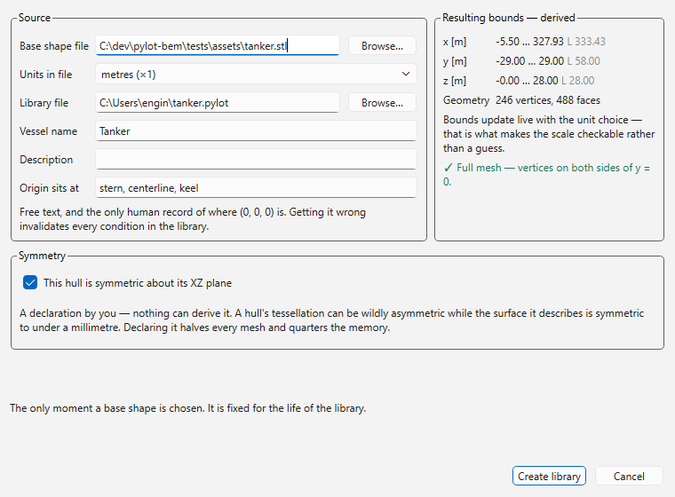

The base shape is imported once and **fixed for the life of the library**. Every
mesh and result is built against it, so replacing it is refused rather than
detected afterwards.

Three fields need thought.

**Units in file.** The only unit conversion in the entire system. STL carries no
units, so if the model is drawn in millimetres, say so here. The bounds on the
right update live under whichever unit you pick, which is what makes the choice
checkable instead of a guess — a 333 m tanker and a 333 mm one are hard to
confuse when the numbers are on screen.

**Origin sits at.** Free text, and the only human record of where `(0, 0, 0)` is
on the hull. Nothing derives it and nothing parses it. Getting it wrong
invalidates every condition in the library, because `z_origin` is measured from
it.

**Symmetry.** A *declaration by you*, not a measurement. Nothing can derive it: a
hull's tessellation is routinely asymmetric while the surface it describes is
symmetric to under a millimetre. Declaring it halves every mesh and quarters the
memory, and the solver mirrors the missing half. The panel on the right refuses a
file that is already a half mesh — a half hull plus a symmetry declaration means
a quarter vessel, and the result is silently wrong rather than obviously broken.

---

## 2. Add a floating condition

Right-click the library → `New condition…`

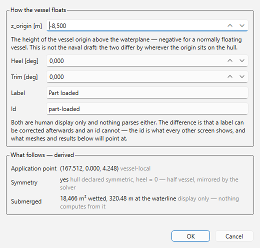

A condition is a 4×4 transform from vessel-local into diffraction space. You give
it three numbers; the transform is built from them.

**`z_origin` is not the draft.** It is the height of the vessel origin above the
waterplane, negative for a normally floating vessel. The two coincide only when
the origin happens to sit on the keel. This is the single most common way to
build a library that is quietly wrong.

**Heel and trim are in degrees here and slopes everywhere else.** Storage, the
API and the CLI all use slopes. The user interface is the only place degrees
appear, and it never shows a slope as a secondary readout — one number, one unit,
at each boundary.

**Both are a positive rotation about their own axis**, by the right-hand rule,
in a frame that is right-handed with z up and x forward — so +y points to port.
Positive **heel** is about +x and puts **starboard down**; positive **trim** is
about +y and puts the **bow down**.

The derived panel updates as you type:

- **Application point** — the centre of the submerged bounds, vessel-local. This
  is what Capytaine gets as `rotation_center`, and it is what the delivered
  forces apply at. You never supply it.
- **Symmetry** — `hull declared symmetric AND heel == 0`. A heeled condition
  always gets a full mesh regardless of the hull, and you cannot get this wrong
  because it is not a choice.
- **Submerged** — wetted area and waterline length, for a sanity check against
  whatever you believe the vessel displaces.

A condition is **fixed once created**. Only the label can change afterwards.
Editing `z_origin` would invalidate every mesh and result beneath it, and there
is no honest way to update work that has already been done — so make another
condition instead. They are cheap.

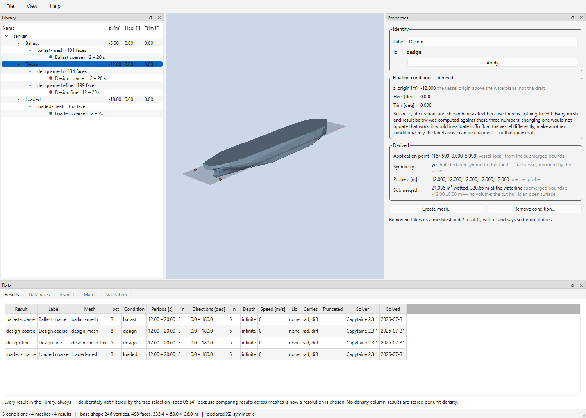

Selected, the view shows the hull at that waterline, the sea plane, the red
surface probes and the application point. The probes are what
[matching](#5-look-at-what-came-back) scores against at runtime.

---

## 3. Build a calculation mesh

Right-click a condition → `Create mesh…`

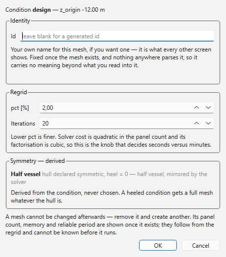

The hull is cut at the waterplane and remeshed. Two knobs:

- **pct** — the regrid target as a percentage of the bounding box; lower is
  finer. Solver cost is quadratic in the panel count and its factorisation is
  cubic, so this is the knob that decides seconds versus minutes.
- **Iterations** — isotropic remeshing passes.

A mesh is **fixed once built**. To change the resolution, make another one — and
keeping both is exactly how two resolutions get compared.

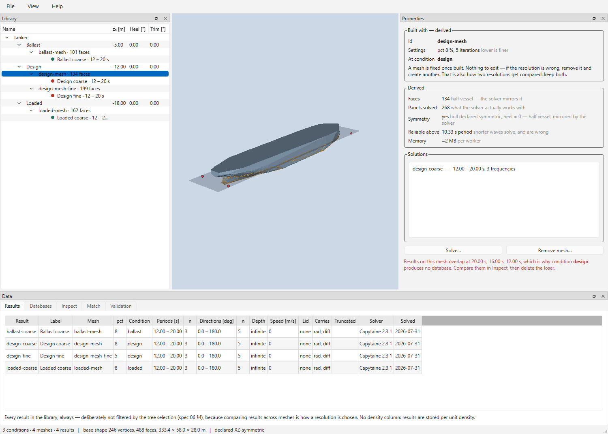

Selected, the mesh is drawn as an orange wireframe over the hull, and the derived
panel gives you what you need before spending anything:

| | |
|---|---|
| **Faces** / **Panels solved** | Stored faces, and what the solver actually works with. For a half vessel the second is double the first |
| **Reliable above** | The shortest wave period this panel size can resolve. **Shorter waves will solve, and the answer will be wrong** by an amount nothing downstream can detect |
| **Memory** | Influence matrix, per worker |

---

## 4. Solve

Right-click a mesh → `Solve…`

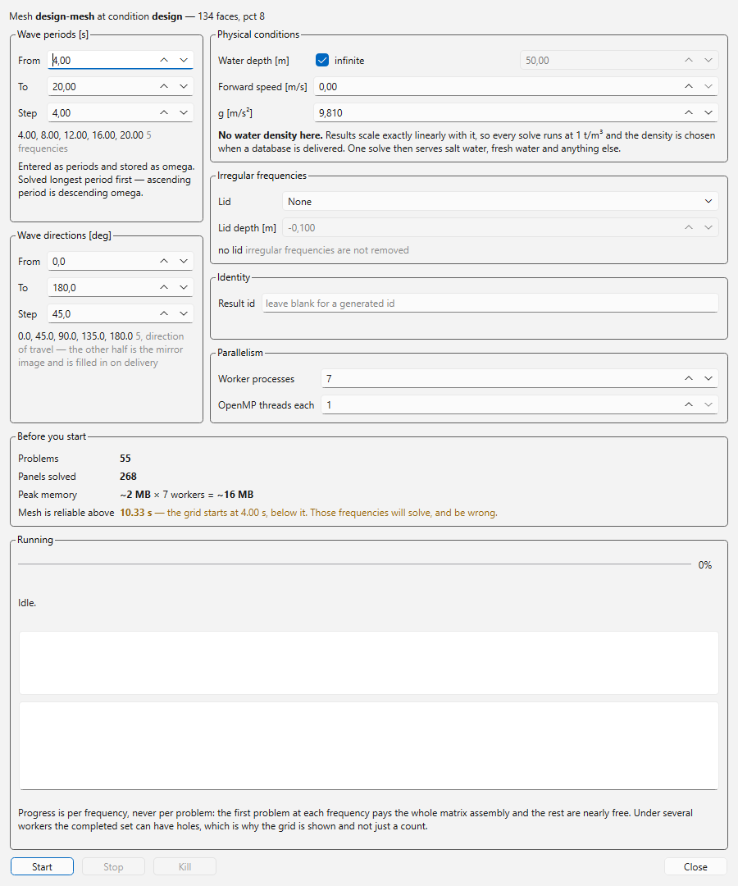

This is Capytaine, in-process, and everything you would expect to set is here.
What is worth reading carefully:

**Periods, not omega.** Entered in seconds and stored as omega. Ascending period
is descending omega, so a grid solves in the reverse of the order you typed it —
longest period first.

**Wave direction is the direction of travel** — where the wave is *going*, not
where it comes from. Capytaine's radians become degrees with a ×180/π and no
offset. For a symmetric mesh the range defaults to 0–180°, because the other half
is the mirror image and is filled in on delivery; solving it computes numbers
that are already known. An asymmetric mesh defaults to 0–360°, and the endpoint
is dropped either way — 0 and 360 are the same heading, and solving both leaves
every consumer with a duplicate column to trip over.

**No water density.** As above. If you are used to passing `rho=1025` to
Capytaine, this is the field you will look for and not find.

**Lid.** Irregular-frequency removal, off by default. A lid is a *solver setting*
regenerated per solve and never stored, which is why `View → Lid mesh` is
permanently disabled and says so.

**Before you start** is the estimate: problems, panels, peak memory across
workers, and the mesh's reliable period checked against the grid you have
actually typed. In the picture above the grid starts at 4 s and the mesh is good
to 10.33 s — Capytaine would also complain about this, but only once the run was
already under way and paid for.

**Parallelism** is process-level: one frequency per task, `n` workers, and OpenMP
threads *each*. Progress is reported per frequency rather than per problem,
because the first problem at a frequency pays for the whole influence-matrix
assembly and the rest are nearly free. The completed set can have holes under
several workers, which is why the grid is drawn rather than a percentage.

**Stop** finishes the frequencies already running and keeps them. **Kill** ends
the workers now. Either way what came back is complete over a shorter grid — a
truncated result is not a damaged one — and the result is marked `truncated` so
you can tell later which run stopped early.

---

## 4a. Batch — a night of it

Right-click the library → `Batch…`, or select some conditions and right-click →
`Batch…` to start with those.

Sections 2 to 4 are how you *explore* a vessel. They are not how you fill in the
forty drafts, three heels and five trims a finished library needs — that is a
night of clicking, and the computer can do it while you are not there.

A batch is two halves, and either can be switched off.

**The grid** is `z_origin` from / to / step, and a list of heels and trims in
degrees. Each is multiplied out, so

```
z_origin  -4.7 to -0.1 step 0.1     47
heel      -1, 0, 1                   3
trim      -2, -1, 0, 1, 2            5
```

is **705 conditions**, which the screen says before you start. Lists take commas
or spaces, and `-5..5..1` is a range.

**The bands** are the second half, and are the reason this is not simply a loop.
One line per mesh, written the way the job is written down:

```
1 -> 1, 2, 3, 4
2 -> 5, 6, 7, 8, 9, 10, 12
```

Each line is `pct → periods`: build a mesh at that resolution, solve exactly
those periods on it. Short waves need panels that long waves do not, and solver
cost is quadratic in the panel count — so a single grid from 1 s to 12 s either
wastes hours at the long end or returns confident nonsense at the short one.
Splitting it is the whole point. `:` works as well as `→`, periods may be a
`4..20..0.5` range, and anything after `#` is a note to yourself.

**Apply to** decides which conditions the bands run on: the grid above, every
condition in the library, or the ones selected in the tree. That last one, with
the grid switched off, is how you add a frequency band to a library that is
already built.

Everything else — directions, depth, gravity, forward speed, lid, workers — is
one setting for the whole job, and means what it means on the Solve screen.
`Lid → Auto` is the one thing a batch can do that the command line cannot: it
resolves per mesh and per band, because by then it is holding both.

### What this job would do

The four counts beside Start are the estimate, and they are computed by walking
the whole job against the library — the same walk that then runs it, so the
preview cannot promise work that does not happen:

| | |
|---|---|
| **Conditions** | new, and how many of the grid are already there |
| **Meshes** | to build, and how many existing ones are reused |
| **Solves** | to run, and how many an existing result already covers |
| **Problems** | six radiation per frequency plus one per direction, summed |

There is deliberately **no memory or panel figure**. Those come out of a regrid
that has not happened yet, and an invented number beside four real ones is
indistinguishable from them. Each mesh reports its own as it is built, in the
log — along with a warning when a band's shortest period is below what that mesh
can resolve.

### Keeping the job

`Save job…` writes everything on the screen to a small text file — `.pylotjob`,
offered beside the library and named after it. `Load job…` reads one back.

A job is four numbers and a table that took a while to get right, and it outlives
the run: it is what you start again after a night that ended early, what you send
to whoever asked for the library, and what says a year later which drafts and
periods the file actually covers. The 705-condition job above is 29 lines:

```json
{
  "pylot_batch_job": 1,
  "z_origins": [ -4.7, -4.6, -4.5, … ],
  "heels_deg": [ -1.0, 0.0, 1.0 ],
  "trims_deg": [ -2.0, -1.0, 0.0, 1.0, 2.0 ],
  "bands": [ { "pct": 1.0, "iterations": 20, "periods": [ 1.0, 2.0, 3.0, 4.0 ] } ],
  "water_depth": null,
  …
}
```

Editable in any text editor: the number lists stay on one line each, angles are
in degrees with the unit in the key, and a field you delete loads as its default.
Infinite depth is `null`.

Loading tells you when the file says something this screen cannot show exactly —
drafts that are not an evenly spaced range, bands at different remesh iterations,
conditions named by an id this library has never had. Nothing is silently
changed; what could not be shown is listed before you press Start.

`pylot_bem.batch.save_job` and `load_job` are the same thing from Python.

### Leaving it running

**A step that fails is logged and the batch carries on.** One `z_origin` that
lifts the hull clear of the water costs that condition and nothing else; the
summary at the end counts the failures so a library with eleven holes in it does
not look finished.

**Running the same job again resumes it.** Conditions already at those values are
reused rather than added beside themselves, meshes at the same `pct` and
`iterations` are reused, and a solve whose every frequency an existing result
already covers is skipped. So a night that ended early needs no arithmetic to
continue — press Start on the same job. When there is genuinely nothing left,
Start greys out and says so. Untick **Resume** to solve it all again anyway,
which produces a second opinion and therefore a conflict, and is meant to.

**Stop** lets the running solve finish, stores it, and starts nothing more.
**Kill** ends the workers now and **discards the solve in flight** — that is
where this differs from the Solve screen, which offers to keep it. There is
nobody here at three in the morning to be asked, and everything already stored
stays either way.

The tree and the tabs update once, when the run ends. A library of seven hundred
conditions redrawn after each of fourteen hundred steps would spend the night
redrawing rather than solving.

---

## 5. Look at what came back

### Results

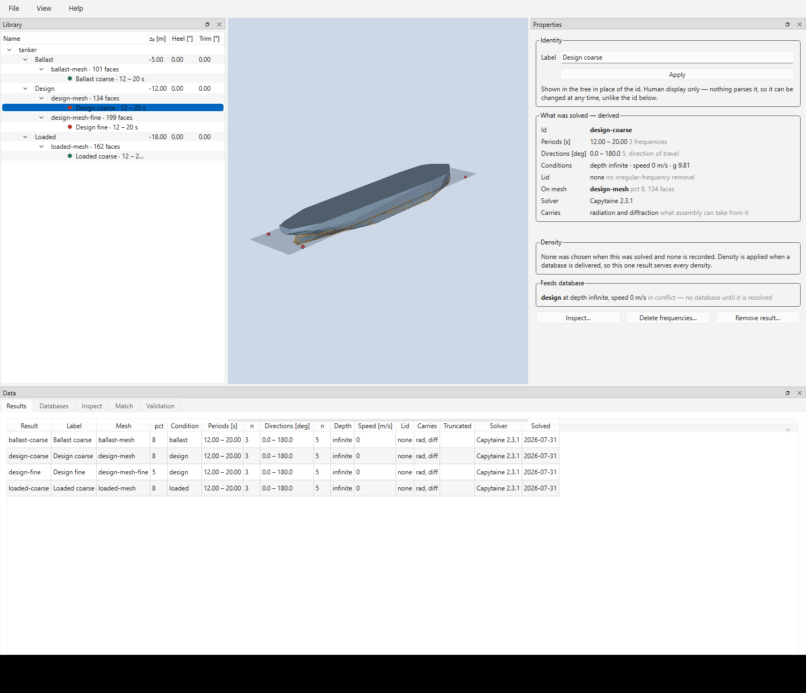

Every result in the library, always — deliberately *not* filtered by the tree
selection, because comparing results across meshes is how a resolution gets
chosen. No density column.

### Databases

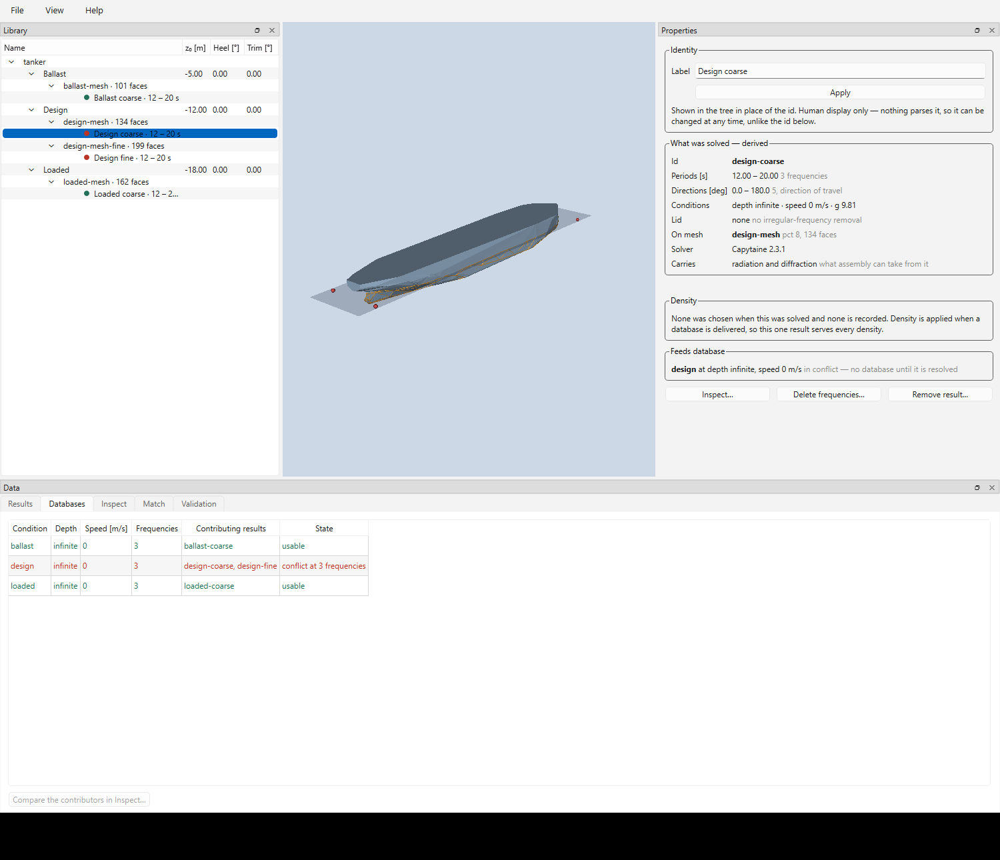

This is the assembly, and the tab you will spend time in. A database is keyed on
**condition × depth × forward speed** — not density. For each key: which results
contribute, how many frequencies, and the state.

In the picture, `design` is **in conflict**: `design-coarse` and `design-fine`
both supply added mass at all three frequencies, and no database can be built
from it until one of them yields. Note what is *not* a conflict — radiation from
one result and diffraction from another at the same frequency is complementary
coverage, and assembles cleanly.

### Inspect

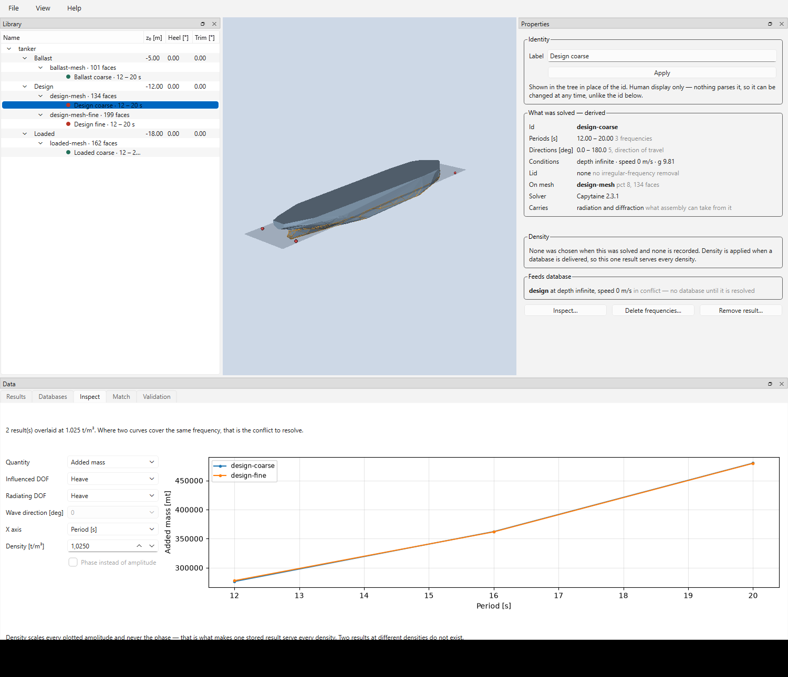

Overlay any number of results. Pick the quantity, the DOF pair, the direction and
the x axis. Where two curves cover the same frequency, that is the conflict, and
seeing how far apart they actually are is how you decide which one to keep — in
the picture the coarse and fine heave added mass are nearly indistinguishable at
this scale, which is an argument for keeping the cheap one.

The density box scales every plotted amplitude and never the phase. That is the
whole of what density does, made visible.

### Match

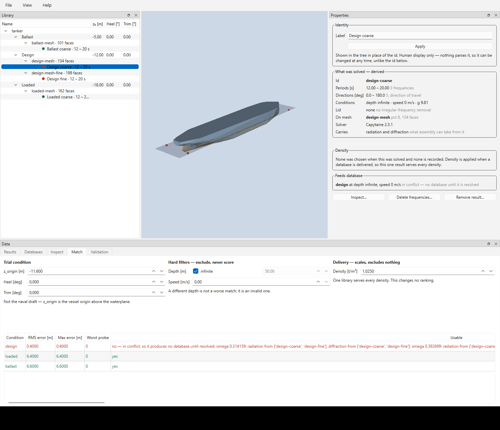

The runtime side, run against a trial pose. Enter how the vessel is floating and
every condition is ranked by RMS surface-probe error.

The three columns are three different kinds of input, and the tab keeps them
apart on purpose:

- **Trial condition** — scored. `z_origin`, heel, trim.
- **Hard filters** — depth and forward speed *exclude*, never score. A different
  depth is not a worse match; it is an invalid one.
- **Delivery** — density scales what comes out and changes no ranking at all.

There is no threshold and no "best match" badge. The list is complete, ascending
by error, unusable candidates included with the reason — as here, where the
closest match by far is the condition that happens to be in conflict.

### Validation

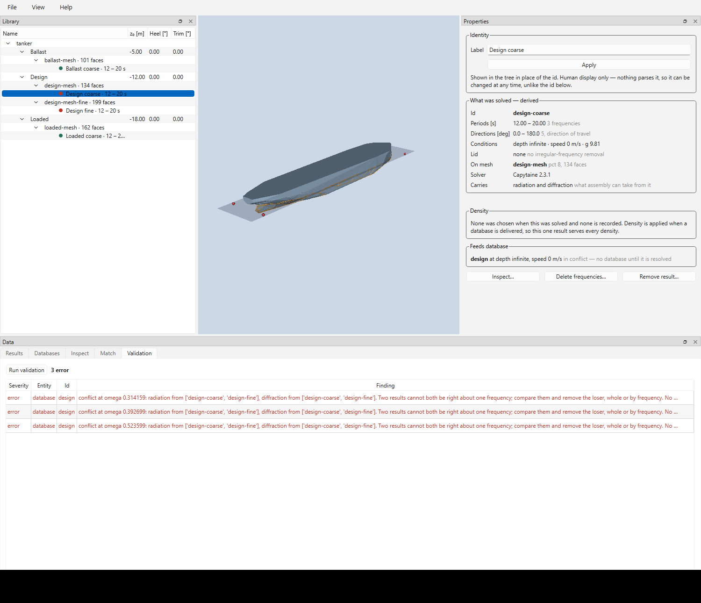

Structured findings, grouped by severity, over the whole library. A `.pylot` file
is a single SQLite blob and cannot be inspected in a text editor, so this is the
only diagnostic there is.

---

## 6. Resolve a conflict

Two results claiming the same frequency on the same condition. Nothing resolves
it for you; there are two ways to resolve it yourself.

### Trim frequencies

Right-click a result → `Delete frequencies…`

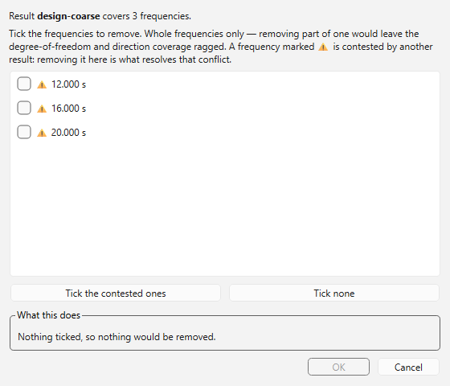

Whole frequencies only — removing part of one would leave the DOF and direction
coverage ragged. Contested frequencies are marked, and `Tick the contested ones`
selects exactly those. Removing them from the loser is the surgical fix, and it
keeps both results for the frequencies where each is the only one.

### Merge

Select several results → right-click → `Merge…`

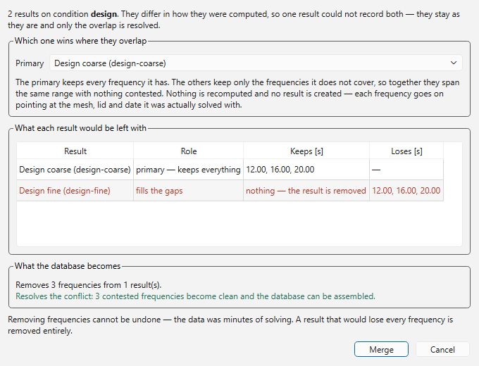

The same operation expressed as a decision about the whole set. Choose a
**primary**; it keeps every frequency it has, and each of the others keeps only
what the primary does not cover. Nothing is recomputed and no new result is
created — every frequency goes on pointing at the mesh, lid and date it was
actually solved with, which is the property that makes this safe.

The table shows what each result would be left with before you commit. A result
that would lose every frequency is removed entirely, and the panel says so. Where
two results differ in nothing but the frequencies they cover — same mesh, same
lid, same directions, same depth — they are simply **combined** instead, since
there is no conflict to resolve and nothing to lose.

Removing frequencies cannot be undone. The data was minutes of solving.

---

## 7. Get the data out

The application builds and inspects libraries; it does not export. Delivering a
`mafredo.Hyddb1` is the reading half, and that is `pylot-db` — which is a
dependency of this package, so it is already installed:

```python
import numpy as np
from pylot_db import Library

with Library.open("tanker.pylot") as library:
    ranking = library.select(z_origin=-11.6, heel=0.0, trim=0.0,
                             water_depth=np.inf, forward_speed=0.0)
    selection = library.deliver(ranking.best, rho=1.025)

selection.hyddb              # a mafredo.Hyddb1
selection.application_point  # (3,) vessel-local, where the forces apply
```

Nothing on the reading side needs Capytaine, or this package. That is the point
of the split: whoever *uses* a library you built here does not have to install a
BEM solver to do it.

See [`api.md`](api.md) for the building side and `pylot-db`'s own `api.md` for
the reading side.

---

## Conventions — the short list

Also under `Help → Conventions`.

| | |
|---|---|
| **Lengths** | Metres, everywhere. The only conversion is at base-shape import |
| **`z_origin`** | Not the draft. Height of the vessel origin above the waterplane |
| **Heel and trim** | Degrees in this interface, slopes in storage and every API |
| **Sign of heel and trim** | A positive rotation about the axis. Positive heel puts **starboard down**, positive trim puts the **bow down** |
| **Frequency** | Periods in seconds in this interface, omega in storage |
| **Wave direction** | Direction of travel — where the wave is going |
| **Density** | t/m³. Solves run at 1.0; density is applied on delivery, never stored |
| **Application point** | Derived from the submerged bounds. Vessel-local |
| **Labels** | Human display only. **No behaviour anywhere parses one** |

---

## Regenerating these pictures

Every screen grab here is generated by [`screenshots.py`](screenshots.py):

```bash
uv run python docs/screenshots.py
```

It builds a small library from `tests/assets/tanker.stl` in a temporary
directory, drives the window through it, and writes `docs/images/*.png` — so the
manual's pictures can be brought back in line with the interface rather than
drifting away from it.

It needs a real display and takes the grabs off the screen, because the 3D view
is a native VTK child window that Qt's own painting renders as a black
rectangle. Leave the window alone while it runs.
