# The pylot application — user manual

For someone who already knows Capytaine. This does not explain boundary element
methods, panel meshes or radiation-diffraction theory; it explains what `pylot`
puts *around* them and where it will surprise you.

- [What this is](#what-this-is)
- [Starting it](#starting-it)
- [The window](#the-window)
- [Saving, and where your work lives](#saving-and-where-your-work-lives)
- [1. Create a library](#1-create-a-library)
- [2. Add a floating condition](#2-add-a-floating-condition)
- [3. Build a calculation mesh](#3-build-a-calculation-mesh)
- [4. Solve](#4-solve)
- [4a. Batch — a night of it](#4a-batch--a-night-of-it)
- [5. Look at what came back](#5-look-at-what-came-back)
- [6. Resolve a conflict](#6-resolve-a-conflict)
- [7. Get the data out](#7-get-the-data-out)
- [Conventions](#conventions-the-short-list)
- [Regenerating these pictures](#regenerating-these-pictures)

---

## What this is

A **library** is one file — SQLite, extension `.pylot` — holding one hull and
every solve you have run against it. Once saved it stays one file, with nothing
beside it — no `-wal`, `-shm` or `-journal` (the exceptions are in [Saving, and
where your work lives](#saving-and-where-your-work-lives)). Its structure is
four levels deep:

```
library          one base shape, in vessel-local coordinates
└─ condition     how the vessel floats: a 4x4 transform
   └─ mesh       the hull cut at that waterline, in diffraction space
      └─ result  one Capytaine run over a frequency and direction grid
```

Two things about this differ sharply from driving Capytaine yourself.

**A result is not a database.** A database is *assembled* from every result on a
condition, frequency by frequency. Two results that cover different frequencies
combine; two that both claim the same frequency are a **conflict**, and a
condition in conflict produces no database at all until you resolve it. Nothing
picks a winner for you, anywhere in this application. That is the central design
decision, and section 6 is about living with it.

**There is no water density.** Every solve runs at 1 t/m³ and the density is
applied when a database is delivered. Added mass, damping and excitation are all
exactly linear in ρ, so storing it would only create something that could later
be wrong. One library serves salt water, fresh water and anything else.

---

## Starting it

```bash
uv run pylot-bem
```

Equivalently `uv run python -m pylot_bem.app`, and either form takes one
optional argument — a library to open:

```bash
uv run pylot-bem tanker.pylot
```

There are no other options. The application is not a command-line tool; the
command line that *is* one is `pylot` (see `10_cli.md` in the specification).

If the last session ended without saving — a crash, a power cut — the
application offers to get that work back as soon as it starts, before it opens
the library named on the command line; see [If pylot
crashes](#if-pylot-crashes).

---

## The window


Four regions, and each answers a different question.

| | |
|---|---|
| **Library** (left) | *What is in here.* The tree, with z₀, heel and trim as columns so drafts can be compared at a glance. A coloured dot on a result is its database's state: green clean, amber incomplete, red in conflict |
| **3D view** (centre) | *What am I about to solve.* Everything is drawn in diffraction space, so `z = 0` is always the waterplane |
| **Properties** (right) | *What is this thing.* Fields you can edit are boxes; everything derived is text, because a derived value that looks editable is a lie |
| **Data** (bottom) | *What came out.* Five tabs — Results, Databases, Inspect, Match, Validation |

With nothing selected the view shows the **base shape**, in vessel-local
coordinates. Select anything below and the view switches to diffraction space.

`View` toggles each layer — hull, calculation mesh, sea, probes, application
point — and resets the camera. Drag with the left button to orbit, the middle to
pan, the wheel to zoom.

All three panels can be closed, dragged to another edge, or floated. **`View →
Panels` brings a closed one back**, which is the only way back: a dock's own
close button is one-way.

`File → Recent Files` lists the last ten libraries opened, created or saved
under a new name, most recent first — click one to reopen it. Each entry is the
file you chose, never its working copy. Reopening moves it back to the top
rather than adding a duplicate. A file that has since been moved or deleted
drops off the list the moment opening it is tried and fails; a library this
build merely refuses to open — the wrong schema version, say — stays, since
it is still the file you are looking for.

`Help → Conventions — units and frames` is the same list as the end of this document, one keystroke
from wherever you are.

---

## Saving, and where your work lives

`pylot` treats a library the way a text editor treats a document. **Opening one
does not open your file**: it copies the file to a private folder on your own
disk and opens the copy. Everything you do — a condition, a mesh, a solve, a
rename — happens to the copy, and **your file is not touched again until you
save.**

That is deliberate. A library is a SQLite database, and SQLite working directly
on a file keeps `-wal` and `-shm` files beside it for as long as it is open. In
a folder that Nextcloud or OneDrive is watching, the sync client uploads those
halfway through a write, and two copies of a database that disagree about what
is in the log are a corrupt database. Working on a copy means the file in your
folder is either the old library or the whole new one — never half of anything
— and no `-wal` or `-shm` ever appears beside it.

| | |
|---|---|
| `File → Open library…` | Copies the file and opens the copy. The original is read once and not held open afterwards |
| `File → Save` (`Ctrl+S`) | Replaces your file with the working copy, in one step |
| `File → Save As…` (`Ctrl+Shift+S`) | Writes the working copy to a different file, which is then the one you are working on. The file you started from is left exactly as it was |
| `File → Revert` | Throws away every change since the last save and reads the file again. Asks first if there is anything to lose; with nothing unsaved it simply re-reads, which is how you pick up a version someone else saved |
| `File → Close library` | Closes the library and deletes its working copy |
| `File → New library…` | Builds the library and writes it to the path you chose **straight away**. There is no untitled library, and a new one starts with nothing unsaved |

An asterisk in the title bar — `pylot — D:\vessels\tanker.pylot*` — means the
working copy has changes the file does not. It appears within a couple of
seconds, and it means *something changed*, not *something differs*: add a
condition and delete it again and the asterisk stays until you save. Whatever
a batch stores counts as well.

### Unsaved changes

Closing the library, opening another, creating a new one or leaving the
application with unsaved changes asks:

> **Save changes to tanker.pylot?**

**Save** saves and goes on. **Discard** throws the changes away for good.
**Cancel** puts you back in the window exactly as you were. Logging off or
shutting the machine down asks the same when the system allows a program to ask.

### What Save does

Save takes one consistent snapshot of the working copy, checks it, copies it
beside your file under a temporary name — `~tanker.pylot.1a2b3c4d.tmp`, which
exists for a moment — and only then swaps it in for the original. If the machine
dies halfway through, your file is still the old one, whole. A wait cursor shows
while pylot copies or saves a library — on open, revert, new library and recover
as well as on save — because on a big library or a slow disk that is long enough
for the window to look hung.

**A save that fails leaves your file exactly as it was**, and that includes the
files beside it. A library written by an older version can have a `-wal` next to
it holding recent work. Just before the swap, Save moves that `-wal` (and any
`-shm` or `-journal`) aside under a temporary name — SQLite would otherwise
replay it onto the new file — but only for the length of one attempt at the
swap. If the attempt fails, it moves them straight back, so waiting for a file
that is in use never leaves the library without its `-wal`; once a swap has
worked it deletes them.

Any other reason a save cannot happen — a full disk, a folder you may not write
to — is reported with the system's own words, and the changes stay in the
window.

If pylot itself dies in the middle of a save, the temporary files are the only
trace:

- `~tanker.pylot.1a2b3c4d.tmp` is a copy of the new version, possibly only half
  written, and is safe to delete. Your changes are still in the working copy,
  which the next start offers back. Deleting it is optional: the next save to
  that file removes it by itself once it is more than ten minutes old (a younger
  one is left alone, in case another window is still writing it).
- `~tanker.pylot-wal.1a2b3c4d.tmp` (or `-shm`, `-journal`) with the same number
  is your file's own `-wal`, moved aside for the length of one attempt at the
  swap; it exists only for a library written by an older version, and it stays
  only if pylot died in that instant, or a save could not put it back (after a
  failed attempt) or delete it (after a successful one).
  **It is never deleted automatically, because it may hold the only copy of some
  recent work.** If the library, opened as it is, seems to lack recent work from
  an older version, rename it back to `tanker.pylot-wal` (and `-shm` or
  `-journal` likewise) before you open the library again. If
  `~tanker.pylot.1a2b3c4d.tmp` is still there, the swap never happened and this
  is what to do. If it is gone, the swap most likely did happen and the `-wal`
  belongs to the old version — but a later save also removes an old
  `~tanker.pylot.1a2b3c4d.tmp`, so check that the library has the work you
  expect before you delete it.

**Save As…** offers the file you have open as the starting point and adds
`.pylot` if you type a name without one. If the name you typed, with `.pylot`
added, is a file that already exists, pylot asks *tanker.pylot already exists.
Replace it?* before it writes anything — the file dialog only checked the name as
you typed it, so the question is pylot's own. **No** is the default, and Escape
means No. Saving over the file you already have open is just Save, and is checked
like one; a name you typed with a suffix of its own is confirmed by the file
dialog and not asked again.

### If the file changed while you were working

Before it replaces your file, Save checks that it is still the file you opened.
If it is not — a colleague saved a new version, your sync client brought one
down, you have the library open in a second window of the application — saving
would throw their work away, so you are asked:

> **tanker.pylot was changed by someone else since it was opened.**
> Saving would replace their changes with yours.

- **Overwrite** — replace it with yours anyway.
- **Save As…** — write yours somewhere else and keep both.
- **Cancel** — do nothing. This is the default, and your changes stay in the window.

Nothing merges two people's work; one of you keeps theirs, or both keep a file.

The check is on content, not on the clock. Size and modification time are
compared first, and when those differ the contents are compared, because a sync
client rewrites modification times without changing a byte, and an alarm about a
change that is not one teaches people to click through the real ones. A file
that has been deleted or moved is not a change either: Save simply writes it
again. After you save, the file you wrote is the baseline, so a second save does
not object to the first.

### If the file is in use

Windows will not replace a file while any program has it open. Save keeps trying
for about eight seconds before it gives up, because whatever has the file — a
virus scanner, a sync client in the middle of an upload — usually lets go within
moments. That includes the `-wal`, `-shm` or `-journal` beside a library written
by an older version, which Save has to move out of the way before the swap: a
program holding one of them is waited for exactly like one holding the library.
The changed-on-disk check above is repeated on every attempt during that
wait, so a version that lands in those seconds gets you the question, not an
overwrite. If the file stays in use:

> **tanker.pylot cannot be saved right now.**

The box names the file and the reason, says that another program — a sync client,
DAVE, a virus scanner — may have it open or that it may be read-only, and that
your changes are safe in the window. **Retry**, **Save As…** or **Cancel**.
Nothing was written, your file is exactly as it was, and nothing is lost.

The usual cause is a program that has the library open — DAVE, say — or a sync
client or antivirus scan that has not finished with it; close the program, or
wait, and press Retry. A file marked read-only gives the same box, with the
reason *is read-only, so it cannot be replaced*: clear the attribute, or Save As.

### Batch runs save themselves

`File → Save when a batch finishes` is ticked by default, and the choice is
remembered. When a batch ends — finished, stopped, killed or failed — the library
is saved, everything unsaved and not only what the batch wrote. When that has
happened the status bar message always ends with *Saved automatically after the
batch.* — after the run's summary (*Finished after …*, *Stopped early after …*,
*Killed after …*), after *The batch failed.* when the run itself could not go on,
or after *The batch was closed before it finished.* when you closed the batch
screen over a running batch (which asks first, and kills it). It is a Save like
any other, with the same checks: if the file was
changed by someone else meanwhile, or is in use, you get the same question,
over the batch screen if that is still open. Nobody is there to answer it at
three in the morning, so it waits, and the results stay safe in the working copy
until you do. If that Save is then cancelled or fails, the sentence is missing
from the status bar and the asterisk stays in the title.

Untick it to save yourself — useful when a batch is an experiment whose results
should not replace the file you opened.

Until the batch ends, what it has stored is in the working copy and not yet in
your file. A run of hours reaches the file when it finishes, which is what the
next section is for if the machine does not last that long.

### If pylot crashes

A crash, a power cut or a killed process does not take the work with it: the
working copy is in a folder that survives the process, and within a couple of
seconds of a change pylot has recorded that the copy holds unsaved work. The
next time pylot starts it says so:

> **pylot did not shut down cleanly, and tanker.pylot had unsaved changes.**

The box also says when the work was last recorded.

- **Recover** — opens the working copy as it was, as unsaved changes. Carry on,
  then save. Save compares your file with how it was when that session last read
  or wrote it, so if it has moved on since, you get the changed-on-disk question
  above. If the session's record of how the file looked has itself been lost,
  pylot cannot tell whether it moved on, so the first Save asks the same question
  (**Overwrite**, **Save As…** or **Cancel**) rather than overwriting silently;
  once you have answered it, saving is checked as usual.
- **Discard** — deletes the recovered copy. If another running pylot has taken
  that work over since the question was asked, nothing is deleted and you are
  told so.
- **Later** — leaves it alone and asks again the next time pylot starts.

pylot holds one library at a time, so when several sessions left work behind it
recovers one and offers the rest at the next start. A session that died with
nothing unsaved is simply cleaned up.

**If Recover says the library could not be recovered.** The box is titled *Could
not recover the library* and gives the reason — the working copy would not open,
because the file inside it is damaged, for example. Nothing has been changed or
deleted. The message names the file, and the folder it sits in (under the work
root, see [Where the working copies live](#where-the-working-copies-live)) is
left exactly as it was; pylot offers it again at the next start.

Before you touch anything in that folder, **copy the whole folder** somewhere
safe. Keep the `-wal` and `-shm` files that sit beside the `.pylot` in it: the
latest changes may exist only in the `-wal`, and SQLite needs it to replay them
when the file is next opened. A copy of the `.pylot` on its own can lose that
work, and a program that opens the original in place replays the `-wal` and
normally deletes it when it closes — so work on the copy, and leave the
original folder as it is until you are sure of the result.

### Where the working copies live

Not the system's temporary folder, which some systems empty at boot, and not
beside the library, which is the synced folder this exists to stay out of.

| | |
|---|---|
| Windows | `%LOCALAPPDATA%\pylot-bem\work` |
| macOS | `~/Library/Application Support/pylot-bem/work` |
| Linux and others | `$XDG_STATE_HOME/pylot-bem/work`, or `~/.local/state/pylot-bem/work` |

Each open library has a folder of its own, with a random name of 32 hexadecimal
characters: the copy (with the `-wal` and `-shm` SQLite keeps beside it, which
does no harm in a folder nothing else watches), two small files pylot uses to
keep track of it, and a staging file for as long as a save runs. It is deleted
when you close the library, so there is nothing to clean up, and no reason to
open one — except after a [failed recovery](#if-pylot-crashes).

pylot reads, locks and deletes only folders with such a name. Anything else in
the work folder is left alone, so it can be a folder you already use for other
things.

**To move them** — to a bigger drive, for a very large library — set the
environment variable `PYLOT_BEM_WORK_DIR` before starting pylot:

On Windows (it applies to programs started afterwards):

```
setx PYLOT_BEM_WORK_DIR D:\pylot-work
```

On macOS and Linux:

```
export PYLOT_BEM_WORK_DIR=/data/pylot-work
```

Budget about twice the library's size there — the copy, and the snapshot a save
takes from it — and room for one more copy of the library beside the original
while a save runs. Recovery looks only in the folder currently in force, so save
or discard anything unsaved before you move it.

### A saved library is one plain file

A library pylot has saved has no `-wal`, no `-shm` and no `-journal` beside it,
which is what makes it safe to leave in a synced folder, to email, or to copy in
Explorer. A library written by an older version may have a `-wal` beside it
holding recent work: opening carries that into the working copy, and the first
save that succeeds removes the leftovers (one that fails leaves them where they
were).

This is the application. The Python API and the `pylot` command line do not
work on a copy: they write the file in place, and `Pylot.close()` leaves it as a
single file when it can. See [`api.md`](api.md#workspace--editing-a-copy) for
that, and for doing what the application does from a script.

**Opening a `Pylot` rewrites the file, even if the script only reads.** Every
`Pylot.open()` / `close()` pair rewrites the file's header — WAL mode on, then
back to rollback mode — which changes the file's modification time *and* its
content hash. A sync client uploads it again, and an application session with
unsaved changes to the same file will report it as changed by someone else at its
next Save. A script that only reads should use
`Library.open(path, read_only=True)`, which touches nothing; see [Get the data
out](#7-get-the-data-out).

---

## 1. Create a library

`File → New library…`

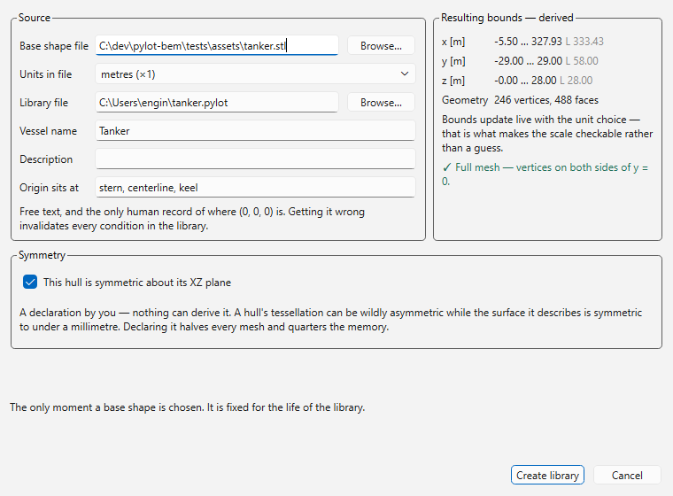

The dialog also asks where the file goes, and will not accept a path that
already exists. Accepting it builds the library and **writes it there straight
away** — there is no untitled library to save later — and opens it with nothing
unsaved. If the library already on screen has unsaved changes you are asked about
those first, before the dialog, so there is still something to cancel back to.

The base shape is imported once and **fixed for the life of the library**. Every
mesh and result is built against it, so replacing it is refused rather than
detected afterwards.

Three fields need thought.

**Units in file.** The only unit conversion in the entire system. STL carries no
units, so if the model is drawn in millimetres, say so here. The bounds on the
right update live under whichever unit you pick, which is what makes the choice
checkable instead of a guess — a 333 m tanker and a 333 mm one are hard to
confuse when the numbers are on screen.

**Origin sits at.** Free text, and the only human record of where `(0, 0, 0)` is
on the hull. Nothing derives it and nothing parses it. Getting it wrong
invalidates every condition in the library, because `z_origin` is measured from
it.

**Symmetry.** A *declaration by you*, not a measurement. Nothing can derive it: a
hull's tessellation is routinely asymmetric while the surface it describes is
symmetric to under a millimetre. Declaring it halves every mesh and quarters the
memory, and the solver mirrors the missing half. The panel on the right refuses a
file that is already a half mesh — a half hull plus a symmetry declaration means
a quarter vessel, and the result is silently wrong rather than obviously broken.

### If the hull's topology is wrong

The import checks that the file is a full mesh, and no more — whether the surface
is **two-manifold** is not known until something tries to cut it, which is the
first floating condition. When that fails, `New condition…` says so in its own
panel and refuses to go on: *not two manifold*, plus what that means. It is not a
crash and the library is not damaged; the geometry inside it cannot be cut at a
waterplane.

The cure is upstream. The pipeline needs a closed surface with no holes, no
duplicated or T-junction faces, no edge shared by more than two triangles and no
self-intersections. MeshLab's cleaning filters are this same code, so a hull it
repairs is a hull this accepts. Then build the library again — a base shape is
fixed for the life of one, so it cannot be swapped into this one.

---

## 2. Add a floating condition

Right-click the library → `New condition…`

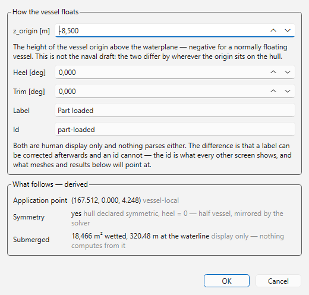

A condition is a 4×4 transform from vessel-local into diffraction space. You give
it three numbers; the transform is built from them.

**`z_origin` is not the draft.** It is the height of the vessel origin above the
waterplane, negative for a normally floating vessel. The two coincide only when
the origin happens to sit on the keel. This is the single most common way to
build a library that is quietly wrong.

**Heel and trim are in degrees here and slopes everywhere else.** Storage, the
API and the CLI all use slopes. The user interface is the only place degrees
appear, and it never shows a slope as a secondary readout — one number, one unit,
at each boundary.

**Both are a positive rotation about their own axis**, by the right-hand rule,
in a frame that is right-handed with z up and x forward — so +y points to port.
Positive **heel** is about +x and puts **starboard down**; positive **trim** is
about +y and puts the **bow down**.

The derived panel updates as you type:

- **Application point** — the centre of the submerged bounds, vessel-local. This
  is what Capytaine gets as `rotation_center`, and it is what the delivered
  forces apply at. You never supply it.
- **Symmetry** — `hull declared symmetric AND heel == 0`. A heeled condition
  always gets a full mesh regardless of the hull, and you cannot get this wrong
  because it is not a choice.
- **Submerged** — wetted area and waterline length, for a sanity check against
  whatever you believe the vessel displaces.

**The label names itself.** Left blank it becomes `z…_h…_t…` — draft in metres,
then heel and trim in degrees, two decimals each: `z-4.70_h-1.00_t2.00`. Each
number carries the letter of what it is, because three signed decimals in a row
are three numbers nobody can tell apart at a glance, and mistaking the metres
for the degrees is an order of magnitude and a unit. The field's placeholder
shows what you are about to get, so accepting it is doing nothing.
The alternative shown everywhere a condition appears is its generated id, and a
tree of seven hundred uuids is a tree nobody can read. Type your own and it is
kept; nothing anywhere parses a label, so it carries no meaning beyond what you
read into it.

A condition is **fixed once created**. Only the label can change afterwards.
Editing `z_origin` would invalidate every mesh and result beneath it, and there
is no honest way to update work that has already been done — so make another
condition instead. They are cheap.

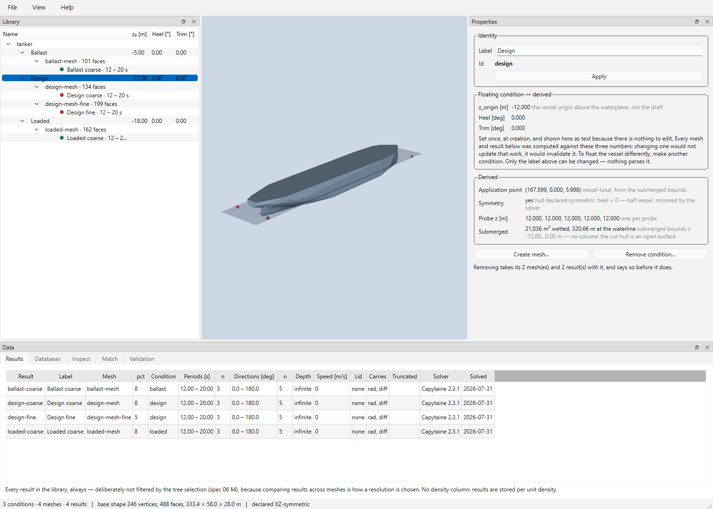

Selected, the view shows the hull at that waterline, the sea plane, the red
surface probes and the application point. The probes are what
[matching](#5-look-at-what-came-back) scores against at runtime.

---

## 3. Build a calculation mesh

Right-click a condition → `Create mesh…`

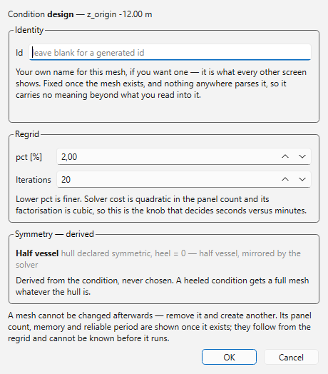

The hull is cut at the waterplane and remeshed. Two knobs:

- **pct** — the regrid target as a percentage of the bounding box; lower is
  finer. Solver cost is quadratic in the panel count and its factorisation is
  cubic, so this is the knob that decides seconds versus minutes.
- **Iterations** — isotropic remeshing passes.

A mesh is **fixed once built**. To change the resolution, make another one — and
keeping both is exactly how two resolutions get compared.

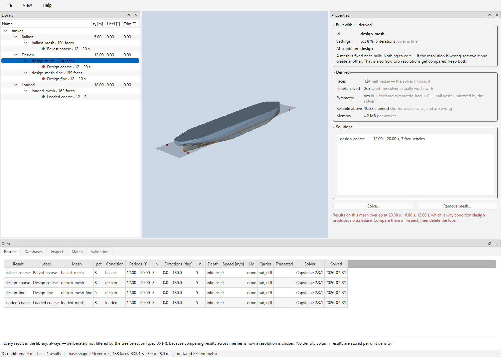

Selected, the mesh is drawn as an orange wireframe over the hull, and the derived
panel gives you what you need before spending anything:

| | |
|---|---|
| **Faces** / **Panels solved** | Stored faces, and what the solver actually works with. For a half vessel the second is double the first |
| **Reliable above** | The shortest wave period this panel size can resolve. **Shorter waves will solve, and the answer will be wrong** by an amount nothing downstream can detect |
| **Memory** | Influence matrix, per worker |

---

## 4. Solve

Right-click a mesh → `Solve…`

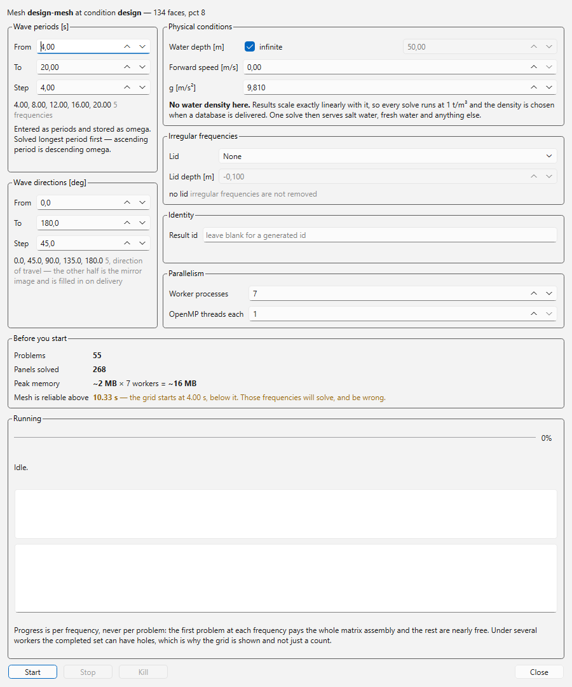

This is Capytaine, in-process, and everything you would expect to set is here.
What is worth reading carefully:

**Periods, not omega.** Entered in seconds and stored as omega. Ascending period
is descending omega, so a grid solves in the reverse of the order you typed it —
longest period first. It opens on 1 to 15 s in half-second steps: 29 frequencies
covering the range a vessel responds in, and a default worth accepting rather
than a placeholder.

**Wave direction is the direction of travel** — where the wave is *going*, not
where it comes from. Capytaine's radians become degrees with a ×180/π and no
offset. For a symmetric mesh the range defaults to 0–180°, because the other half
is the mirror image and is filled in on delivery; solving it computes numbers
that are already known. An asymmetric mesh defaults to 0–360°, and the endpoint
is dropped either way — 0 and 360 are the same heading, and solving both leaves
every consumer with a duplicate column to trip over.

The defaults are right, so you only meet the next part by changing one. A **full
vessel** — an undeclared hull, or any heeled condition — has no half to mirror,
and a grid that stops at 180° leaves the other half of the compass unsolved. The
delivered database still covers 360°: mafredo does not refuse a heading past 180,
it interpolates across what was never solved and answers confidently. Nothing
downstream detects it, so the screen says so in amber beside the grid, and it is
worth reading — it is the one setting here whose mistake is invisible afterwards.

**No water density.** As above. If you are used to passing `rho=1025` to
Capytaine, this is the field you will look for and not find.

**Lid.** Irregular-frequency removal, off by default. A lid is a *solver setting*
regenerated per solve and never stored, which is why `View → Lid mesh` is
permanently disabled and says so.

**Before you start** is the estimate: problems, panels, peak memory across
workers, and the mesh's reliable period checked against the grid you have
actually typed. In the picture above the grid starts at 4 s and the mesh is good
to 10.33 s — Capytaine would also complain about this, but only once the run was
already under way and paid for.

**Parallelism** is process-level: one frequency per task, `n` workers, and OpenMP
threads *each*. Progress is reported per frequency rather than per problem,
because the first problem at a frequency pays for the whole influence-matrix
assembly and the rest are nearly free. The completed set can have holes under
several workers, which is why the grid is drawn rather than a percentage.

**Stop** finishes the frequencies already running and keeps them. **Kill** ends
the workers now. Either way what came back is complete over a shorter grid — a
truncated result is not a damaged one — and the result is marked `truncated` so
you can tell later which run stopped early.

---

## 4a. Batch — a night of it

Right-click the library → `Batch…`, or select some conditions and right-click →
`Batch…` to start with those.

Sections 2 to 4 are how you *explore* a vessel. They are not how you fill in the
forty drafts, three heels and five trims a finished library needs — that is a
night of clicking, and the computer can do it while you are not there.

A batch is two halves, and either can be switched off.

**The grid** is `z_origin` from / to / step, and a list of heels and trims in
degrees. Each is multiplied out, so

```
z_origin  -4.7 to -0.1 step 0.1     47
heel      -1, 0, 1                   3
trim      -2, -1, 0, 1, 2            5
```

is **705 conditions**, which the screen says before you start. Lists take commas
or spaces, and `-5..5..1` is a range.

**The bands** are the second half, and are the reason this is not simply a loop.
One line per mesh, written the way the job is written down:

```
1 -> 1, 2, 3, 4
2 -> 5, 6, 7, 8, 9, 10, 12
```

Each line is `pct → periods`: build a mesh at that resolution, solve exactly
those periods on it. Short waves need panels that long waves do not, and solver
cost is quadratic in the panel count — so a single grid from 1 s to 12 s either
wastes hours at the long end or returns confident nonsense at the short one.
Splitting it is the whole point. `:` works as well as `→`, periods may be a
`4..20..0.5` range, and anything after `#` is a note to yourself.

**Apply to** decides which conditions the bands run on: the grid above, every
condition in the library, or the ones selected in the tree. That last one, with
the grid switched off, is how you add a frequency band to a library that is
already built.

**Wave directions come in two grids**, and this is the one place a job needs
both. A symmetric hull at zero heel is meshed as a half vessel whose port side
mirrors its starboard side, so **half vessel** 0–180° is exact and the rest is
filled in on delivery. Heel that same hull by a degree and the mesh is a **full
vessel** with nothing to mirror, so it needs 0–360°. A grid of heels contains
both kinds, which is why one setting could never have been right for a whole job.

Which grid a solve gets is derived from its mesh, never chosen — the same rule
symmetry itself follows. The screen says which conditions of *your* job get each,
greys the full-vessel row out as unused when the job has no heel in it, and warns
when that row stops short of the whole circle. The problem count is summed per
solve for the same reason: three heels is not three times one heel, it is one
half-circle solve and two whole-circle ones.

Everything else — depth, gravity, forward speed, lid, workers — is one setting
for the whole job, and means what it means on the Solve screen. `Lid → Auto` is
the one thing a batch can do that the command line cannot: it resolves per mesh
and per band, because by then it is holding both.

### What this job would do

The four counts beside Start are the estimate, and they are computed by walking
the whole job against the library — the same walk that then runs it, so the
preview cannot promise work that does not happen:

| | |
|---|---|
| **Conditions** | new, and how many of the grid are already there |
| **Meshes** | to build, and how many existing ones are reused |
| **Solves** | to run, and how many an existing result already covers |
| **Problems** | six radiation per frequency plus one per direction, summed |

There is deliberately **no memory or panel figure**. Those come out of a regrid
that has not happened yet, and an invented number beside four real ones is
indistinguishable from them. Each mesh reports its own as it is built, in the
log — along with a warning when a band's shortest period is below what that mesh
can resolve.

### Keeping the job

`Save job…` writes everything on the screen to a small text file — `.pylotjob`,
offered beside your library file and named after it. It saves the job and not
the library, which is `File → Save`. `Load job…` reads one back.

A job is four numbers and a table that took a while to get right, and it outlives
the run: it is what you start again after a night that ended early, what you send
to whoever asked for the library, and what says a year later which drafts and
periods the file actually covers. The 705-condition job above is 29 lines:

```json
{
  "pylot_batch_job": 1,
  "z_origins": [ -4.7, -4.6, -4.5, … ],
  "heels_deg": [ -1.0, 0.0, 1.0 ],
  "trims_deg": [ -2.0, -1.0, 0.0, 1.0, 2.0 ],
  "bands": [ { "pct": 1.0, "iterations": 20, "periods": [ 1.0, 2.0, 3.0, 4.0 ] } ],
  "water_depth": null,
  …
}
```

Editable in any text editor: the number lists stay on one line each, angles are
in degrees with the unit in the key, and a field you delete loads as its default.
Infinite depth is `null`.

Loading tells you when the file says something this screen cannot show exactly —
drafts that are not an evenly spaced range, bands at different remesh iterations,
conditions named by an id this library has never had. Nothing is silently
changed; what could not be shown is listed before you press Start.

`pylot_bem.batch.save_job` and `load_job` are the same thing from Python.

### Leaving it running

**A step that fails is logged and the batch carries on.** One `z_origin` that
lifts the hull clear of the water costs that condition and nothing else; the
summary at the end counts the failures so a library with eleven holes in it does
not look finished.

**Running the same job again resumes it.** Conditions already at those values are
reused rather than added beside themselves, meshes at the same `pct` and
`iterations` are reused, and a solve whose every frequency an existing result
already covers is skipped. So a night that ended early needs no arithmetic to
continue — press Start on the same job. When there is genuinely nothing left,
Start greys out and says so. Untick **Resume** to solve it all again anyway,
which produces a second opinion and therefore a conflict, and is meant to.

**Stop** lets the running solve finish, stores it, and starts nothing more.
**Kill** ends the workers now and **discards the solve in flight** — that is
where this differs from the Solve screen, which offers to keep it. There is
nobody here at three in the morning to be asked, and everything already stored
stays either way.

**When the run ends, the library is saved.** `File → Save when a batch finishes`
is ticked by default, and it is an ordinary Save, changed-on-disk check
included — see [Batch runs save themselves](#batch-runs-save-themselves), which
also says how to turn it off. Until then everything the run has stored is in the
working copy and not yet in your file; if the machine dies first, the next start
offers it back.

The tree and the tabs update once, when the run ends. A library of seven hundred
conditions redrawn after each of fourteen hundred steps would spend the night
redrawing rather than solving.

---

## 5. Look at what came back

### Results

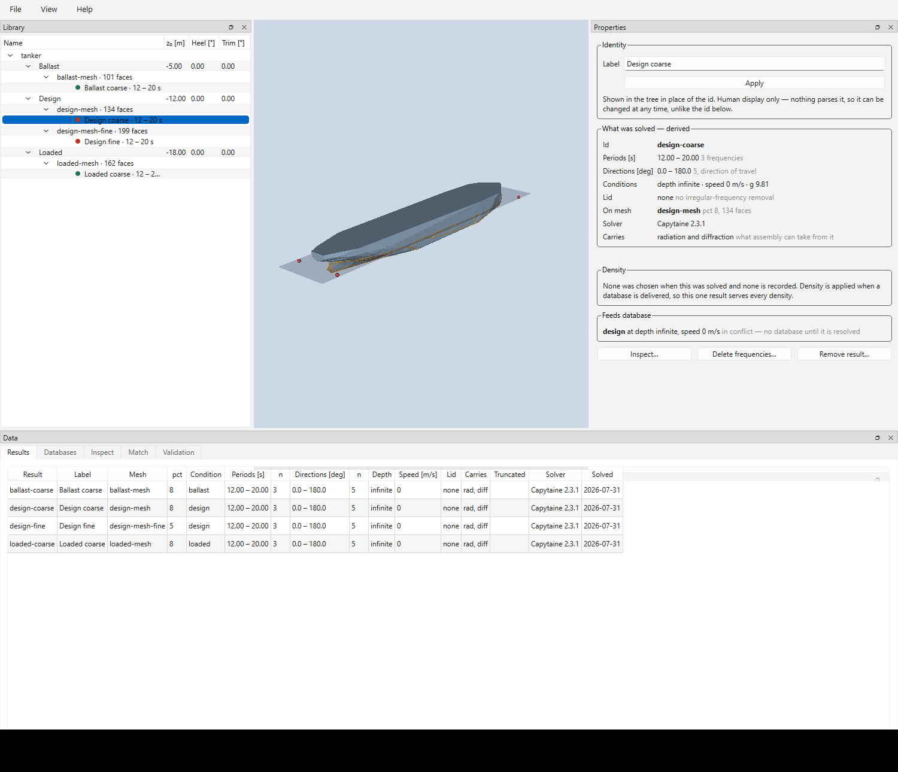

Every result in the library, always — deliberately *not* filtered by the tree
selection, because comparing results across meshes is how a resolution gets
chosen. No density column.

### Databases

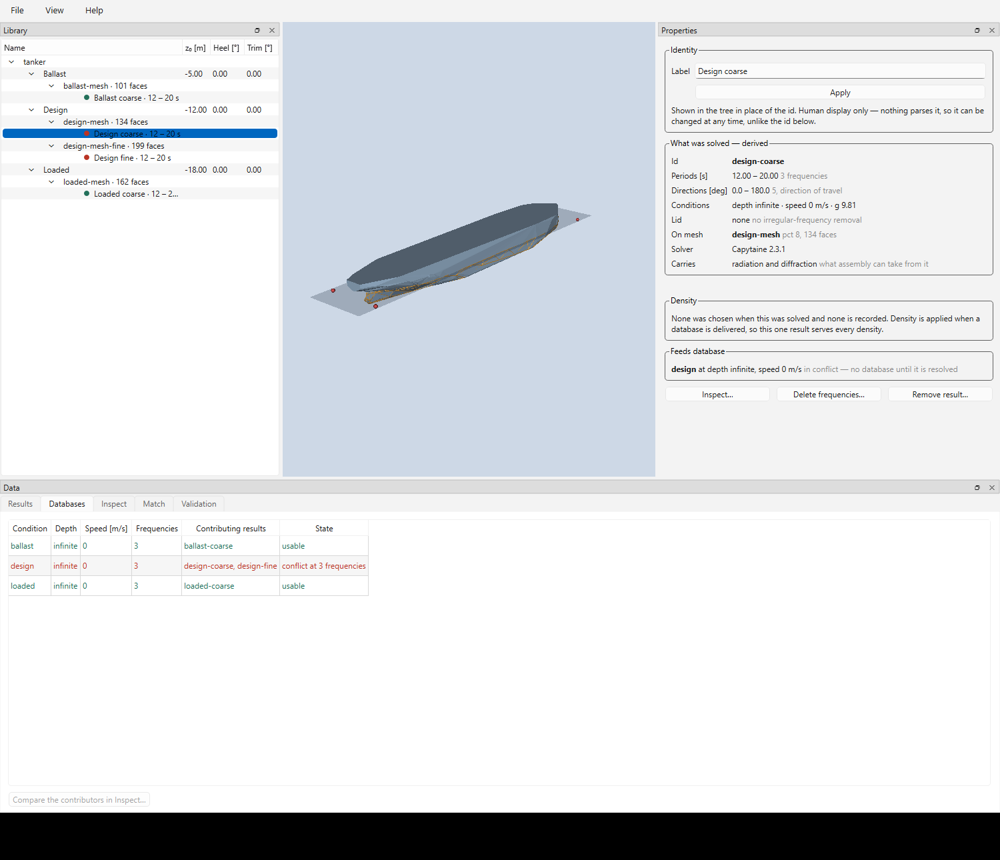

This is the assembly, and the tab you will spend time in. A database is keyed on
**condition × depth × forward speed** — not density. For each key: which results
contribute, how many frequencies, and the state.

In the picture, `design` is **in conflict**: `design-coarse` and `design-fine`
both supply added mass at all three frequencies, and no database can be built
from it until one of them yields. Note what is *not* a conflict — radiation from
one result and diffraction from another at the same frequency is complementary
coverage, and assembles cleanly.

### Inspect

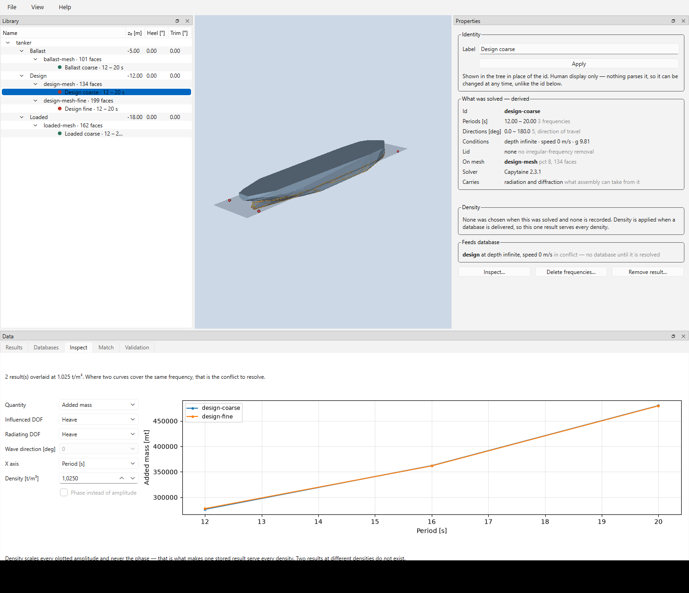

Overlay any number of results. Pick the quantity, the DOF pair, the direction and
the x axis. Where two curves cover the same frequency, that is the conflict, and
seeing how far apart they actually are is how you decide which one to keep — in
the picture the coarse and fine heave added mass are nearly indistinguishable at
this scale, which is an argument for keeping the cheap one.

The density box scales every plotted amplitude and never the phase. That is the
whole of what density does, made visible.

### Match

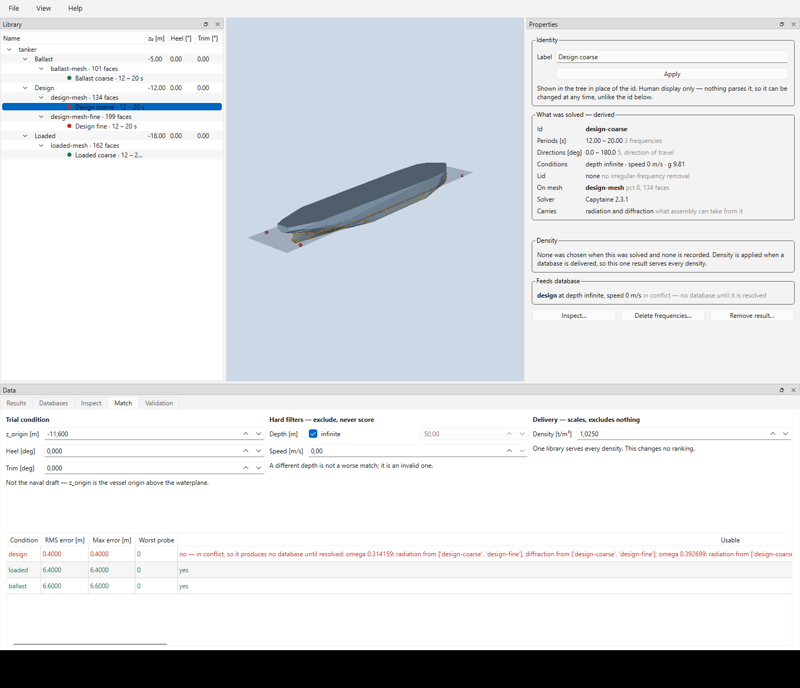

The runtime side, run against a trial pose. Enter how the vessel is floating and
every condition is ranked by RMS surface-probe error.

The three columns are three different kinds of input, and the tab keeps them
apart on purpose:

- **Trial condition** — scored. `z_origin`, heel, trim.
- **Hard filters** — depth and forward speed *exclude*, never score. A different
  depth is not a worse match; it is an invalid one.
- **Delivery** — density scales what comes out and changes no ranking at all.

There is no threshold and no "best match" badge. The list is complete, ascending
by error, unusable candidates included with the reason — as here, where the
closest match by far is the condition that happens to be in conflict.

### Validation

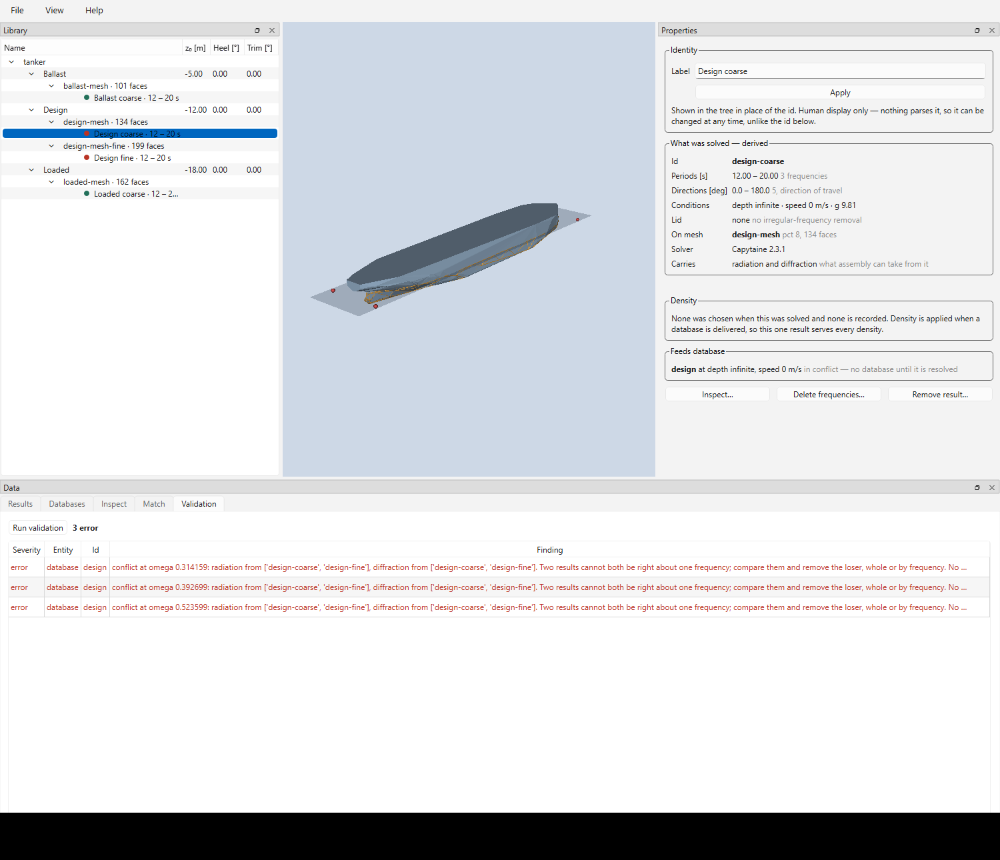

Structured findings, grouped by severity, over the whole library. A `.pylot` file
is a single SQLite blob and cannot be inspected in a text editor, so this is the
only diagnostic there is.

---

## 6. Resolve a conflict

Two results claiming the same frequency on the same condition. Nothing resolves
it for you; there are two ways to resolve it yourself.

### Trim frequencies

Right-click a result → `Delete frequencies…`

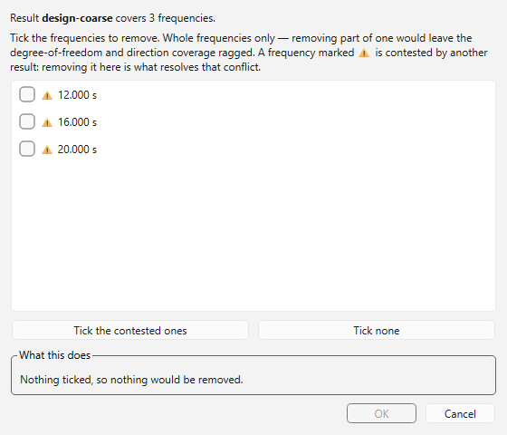

Whole frequencies only — removing part of one would leave the DOF and direction
coverage ragged. Contested frequencies are marked, and `Tick the contested ones`
selects exactly those. Removing them from the loser is the surgical fix, and it
keeps both results for the frequencies where each is the only one.

### Merge

Select several results → right-click → `Merge…`

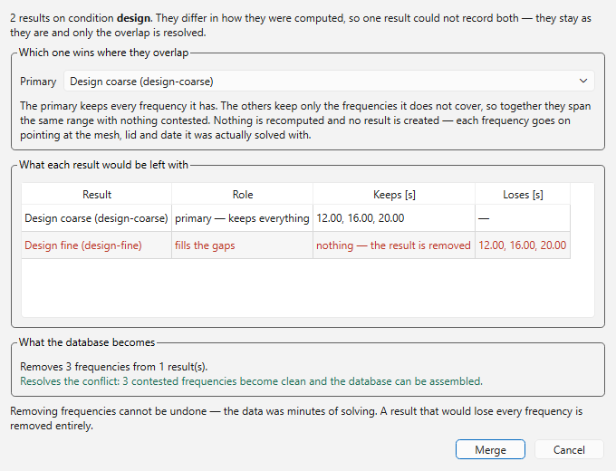

The same operation expressed as a decision about the whole set. Choose a
**primary**; it keeps every frequency it has, and each of the others keeps only
what the primary does not cover. Nothing is recomputed and no new result is
created — every frequency goes on pointing at the mesh, lid and date it was
actually solved with, which is the property that makes this safe.

The table shows what each result would be left with before you commit. A result
that would lose every frequency is removed entirely, and the panel says so. Where
two results differ in nothing but the frequencies they cover — same mesh, same
lid, same directions, same depth — they are simply **combined** instead, since
there is no conflict to resolve and nothing to lose.

Removing frequencies cannot be undone one step at a time. The data was minutes
of solving. Until you save, `File → Revert` is the way back — and it takes every
other change since the last save with it.

---

## 7. Get the data out

The application builds and inspects libraries; it does not export. Delivering a
`mafredo.Hyddb1` is the reading half, and that is `pylot-db` — which is a
dependency of this package, so it is already installed:

```python
import numpy as np
from pylot_db import Library

with Library.open("tanker.pylot", read_only=True) as library:
    ranking = library.select(z_origin=-11.6, heel=0.0, trim=0.0,
                             water_depth=np.inf, forward_speed=0.0)
    selection = library.deliver(ranking.best, rho=1.025)

selection.hyddb              # a mafredo.Hyddb1
selection.application_point  # (3,) vessel-local, where the forces apply
```

`read_only=True` is worth typing: it reads the file without leaving a `-wal` or
`-shm` beside it, and works on a read-only share. A library opened for writing is
put in WAL mode for as long as it is open, which is exactly what a reader in a
synced folder does not want. It also rewrites the file's header, so the
modification time and the hash change even when all you did was look;
`read_only=True` changes neither.

Nothing on the reading side needs Capytaine, or this package. That is the point
of the split: whoever *uses* a library you built here does not have to install a
BEM solver to do it.

See [`api.md`](api.md) for the building side and `pylot-db`'s own `api.md` for
the reading side.

---

## Conventions — the short list

Also under `Help → Conventions`.

| | |
|---|---|
| **Lengths** | Metres, everywhere. The only conversion is at base-shape import |
| **`z_origin`** | Not the draft. Height of the vessel origin above the waterplane |
| **Heel and trim** | Degrees in this interface, slopes in storage and every API |
| **Sign of heel and trim** | A positive rotation about the axis. Positive heel puts **starboard down**, positive trim puts the **bow down** |
| **Frequency** | Periods in seconds in this interface, omega in storage |
| **Wave direction** | Direction of travel — where the wave is going |
| **Density** | t/m³. Solves run at 1.0; density is applied on delivery, never stored |
| **Application point** | Derived from the submerged bounds. Vessel-local |
| **Labels** | Human display only. **No behaviour anywhere parses one** |

---

## Regenerating these pictures

Every screen grab here is generated by [`screenshots.py`](screenshots.py):

```bash
uv run python docs/screenshots.py
```

It builds a small library from `tests/assets/tanker.stl` in a temporary
directory, drives the window through it, and writes `docs/images/*.png` — so the
manual's pictures can be brought back in line with the interface rather than
drifting away from it.

It needs a real display and takes the grabs off the screen, because the 3D view
is a native VTK child window that Qt's own painting renders as a black
rectangle. Leave the window alone while it runs.
